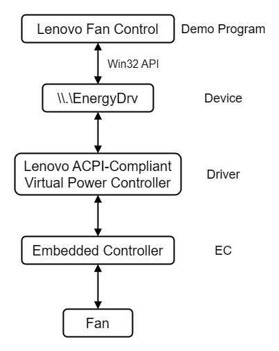

# Lenovo Laptop Fan Control

Language: [中文](README.zh_CN.md)

---

Control fan for Lenovo laptops with `Lenovo ACPI-Compliant Virtual Power Controller` driver on Windows.

This project is for the Lenovo laptops whose fan failed to be controlled with mainstream fan control applications (e.g. Notebook FanControl, SpeedFan, Fan Control) on Windows.

However, this project is not a perfect solution for fan control. It can only control the fan to spin at the maximum speed and dosen't provide any accurate speed control.

# Prerequisites

- Lenovo laptop
- Windows operating system
- `Lenovo ACPI-Compliant Virtual Power Controller` driver installed

# Usage

1. Download binary from [Releases](https://github.com/jiarandiana0307/Lenovo-Fan-Control/releases).

2. Double-click the LenovoFanControl program to run it, then you will see it in system tray.

If a message box saying `Failed to open\\.\EnergyDrv` popped up, it means the Lenovo driver not found or dosen't work as expected. Otherwise, the program works fine and the fan will spin at maximum speed.

Click the program icon in the system tray, a menu will show up. The first line of the menu tell you the state of the fan, which could be `Running`, which means the fan is spinning at maximum speed, or `Stopped`, which means the fan is spinning at normal speed.

You can click the `Start` and `Stop` item on the menu, or use corresponding hotkeys `Ctrl+Alt+R` and `Ctrl+Alt+S` to switch the fan between maximum speed and normal speed.

Finally, you can click the `Exit` item on the menu to terminate the program, then the fan will spin at normal speed.

# Theory

Normally, fan in laptop is controlled by Embedded Controller (EC) which is a device responsible for feeding other parts of the system the electric voltage they need. Therefore if EC pass more voltage to the cooling system, this cause fan to spins at maximum speed. For controlling the EC we can change the EC registers to achieve functionality we want, but for some models, we can't find the registers which was dedicated to controlling the fan speed from datasheets. So one reverse engineering the Lenovo Energy Manager software to find how Dust Removal feature of this app actually works and build this program with it. Then it turns out that this software communicate to the EC through `Lenovo ACPI-Compliant Virtual Power Controller` kernel driver. And it's exactly how this project works.

If you have `Lenovo ACPI-Compliant Virtual Power Controller` driver installed, there will be a `\\.\EnergyDrv` device on your system. This device is created by the Lenovo driver to expose the interfaces for communication with other applications, e.g. Lenovo Energy Manager. The driver provides a dust removal function that can control the fan. Therefore, with win32 API, it's easy to read and write specific bytes of the device to control the Lenovo driver, then the driver controls EC, and the EC controls the fan. See the diagram below.

But there is a problem with this approach, the fan spins periodically. After we instruct the driver to carry out dust removal, the fan spins at maximum speed for about 9 seconds then stops for 2 seconds, and then the next cycle until 2min later. The dust removal is controlled automatically by EC itself, and sometimes may suddenly stop during the 9 seconds of spinning which leads to fan stop spinning for something for 1 to 9 seconds.

For workaround about this problem, firstly, we ask the driver to carry out dust removal, wait for 9 seconds. Then we ask the driver to stop the procedure manually to reset the timing. Finally, we ask the driver to start over the procedure immediately before the fan stop spinning. And then wait for another 9 seconds, then stop, then the next cycle and so on. With the fast on and off switching, the fan won't stop and will spin at the maximum speed all the time except that the speed of the fan will slow down a little bit for a short period of time during the switching time.

# Disclaimer

This project is not responsible for possible damage of any kind, use it at your own risk.

# References

- [IdeaFan][IdeaFan]
- [FanControl][FanControl]
- [Lenovo-IdeaPad-Z500-Fan-Controller][Lenovo-IdeaPad-Z500-Fan-Controller]
- [Windows Drivers Reverse Engineering Methodology][windows-drivers-reverse-engineering-methodology]

[IdeaFan]: https://www.allstone.lt/ideafan/
[FanControl]: https://github.com/bitrate16/FanControl
[Lenovo-IdeaPad-Z500-Fan-Controller]: https://github.com/Soberia/Lenovo-IdeaPad-Z500-Fan-Controller
[windows-drivers-reverse-engineering-methodology]: https://voidsec.com/windows-drivers-reverse-engineering-methodology/
